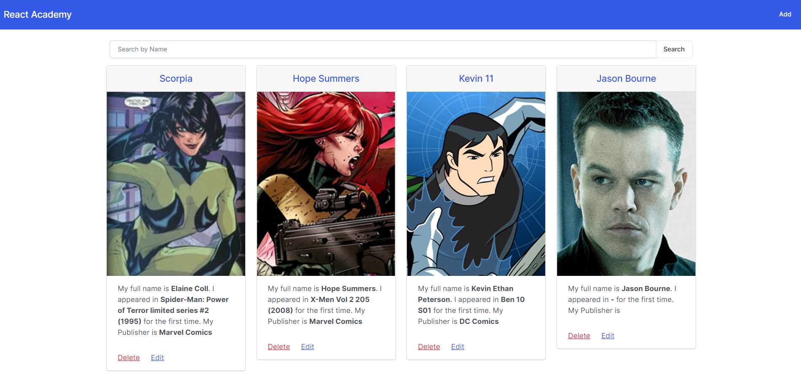
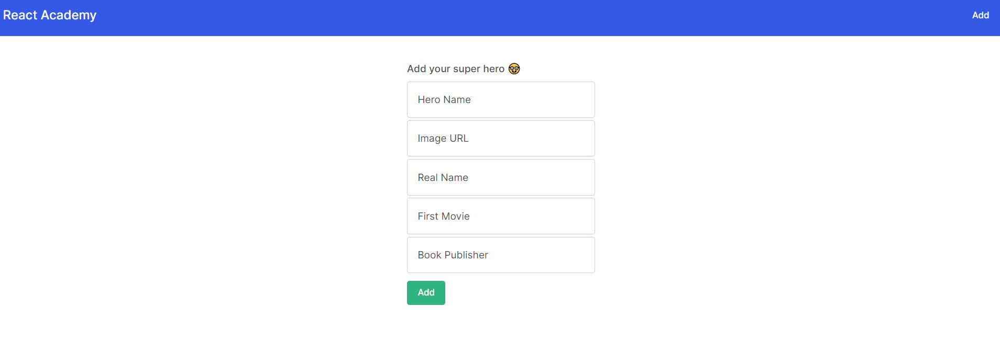
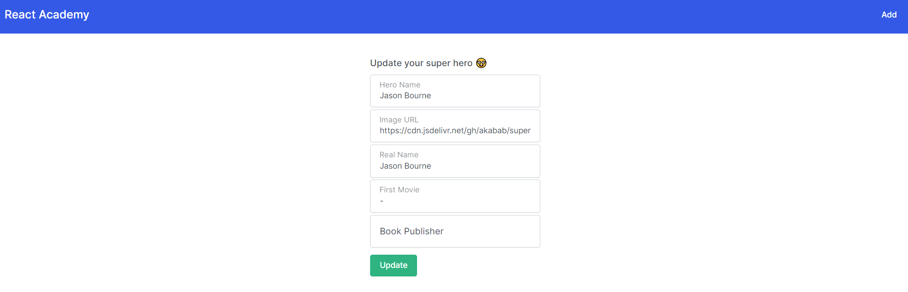

<h1 align="center">welcome to react-redux-hero-app 👋</h1>
<p>
  
  
</p>

> react-redux-hero-app - Demo of React Hooks + Redux CRUD example with Axios & Web API

## 👀 demo

Homepage


Add Hero


Edit Hero


## 🛠 usage

```sh

$ cd react-redux-hero-app

$ yarn

$ yarn start
```

## 🤝 contributing

contributions, issues and feature requests are welcome!

## 🙌 show your support

give a ⭐️ if this project helped you!

---
